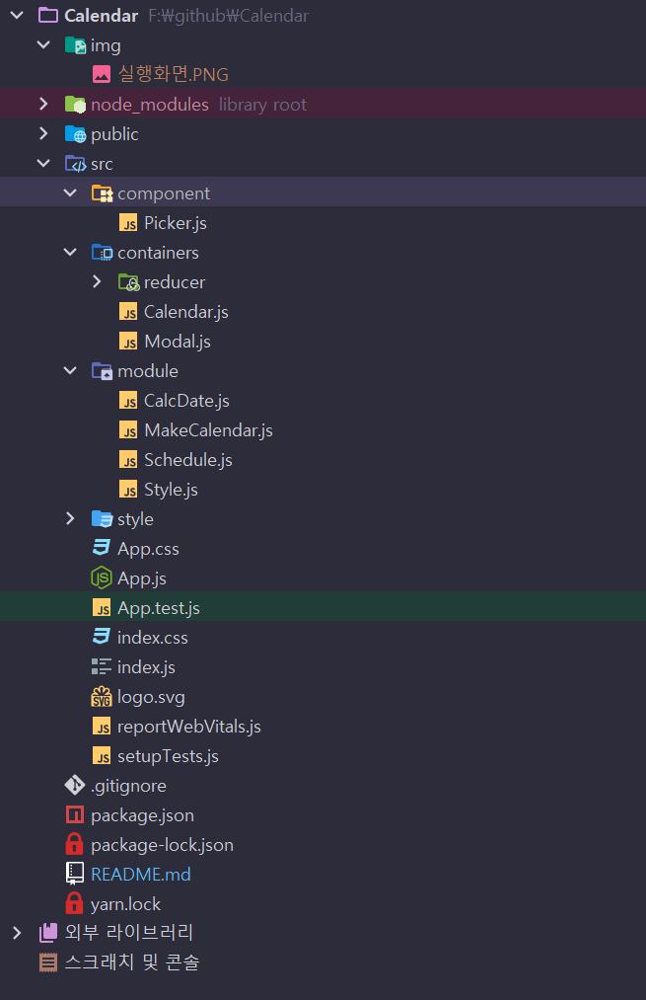
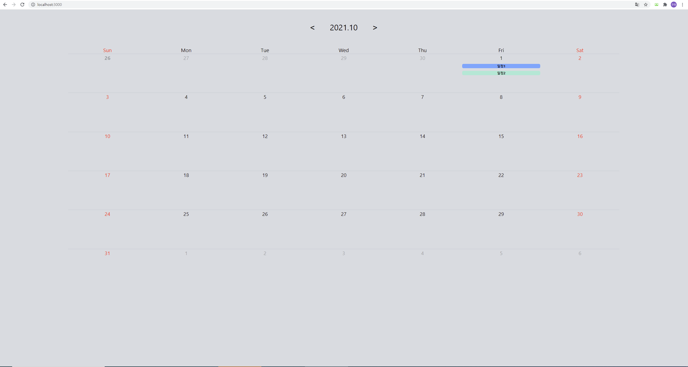
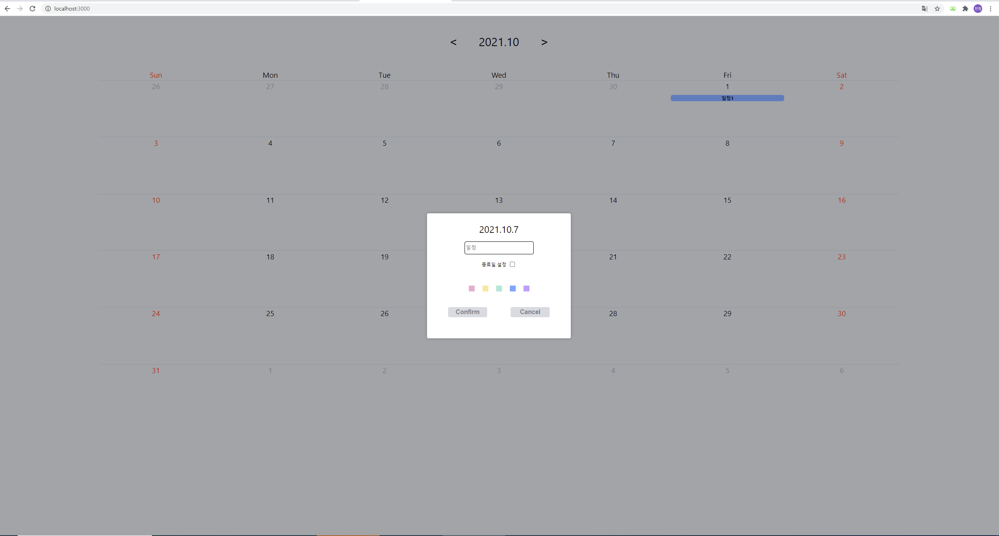

# React 캘린더
외부 라이브러리 없이 구현한 캘린더

# 프로젝트 구조

# 구현 기능 및 동작 원리
* 캘린더 화면
  * 최상단에 연도 및 월, 이동 버튼 표시
  * 7 x n(week) 형태의 격자로 표시
  * 캘린더 상단에 요일을 일월화수목금토 순서로 표시
  * 주말은 빨간색으로 표현
  * 이전, 다음달의 날짜는 흐리게 표현
* 월, 년도 이동 기능
    * 내장 함수 Date를 이용해서 버튼 클릭 시 증감 방식으로 구현
* 일정 입력
    * 해당 날짜 클릭 시 모달 창에서 일정, 일정 색상을 입력을 받고 해당하는 날짜의 칸에 일정 추가
* 색상 선택
    모달 창에서 원하는 일정의 백그라운드 색상 선택 가능
* 2일 이상의 일정
    * 모달 창에서 종료일 설정 체크박스 클릭시 종료일을 입력받는 방식으로 구현
    * YYYY.MM.DD 형식으로 입력하지 않으면 동작하지 않음.

# 실행 화면

